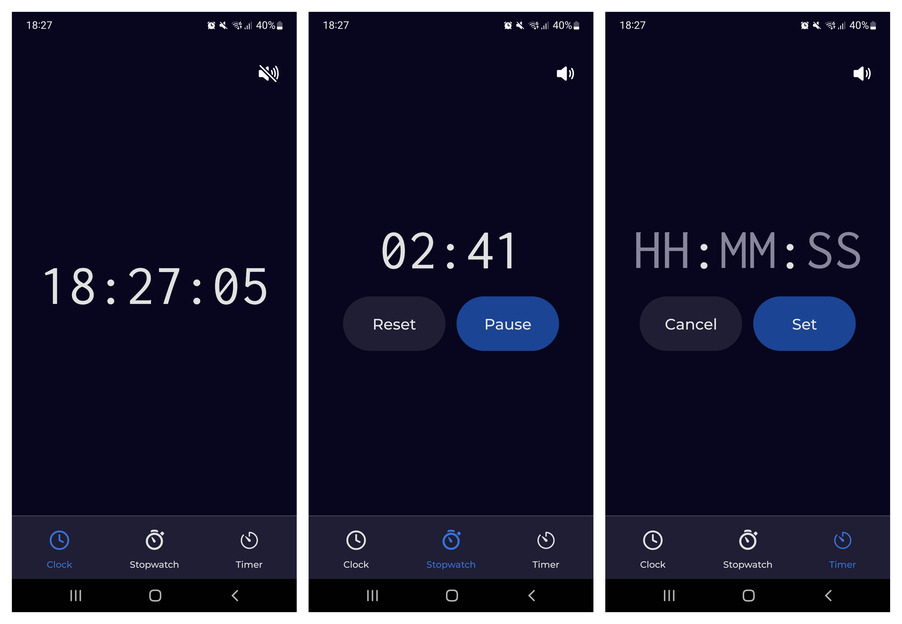

# Tick & Track

A React Native app for mobile devices, featuring a clock, stopwatch, and timer. The app makes a ticking sound every second unless muted, which can be useful for various activities such as workouts, stretching, breathing exercises, music practice, and rhythm training.



## Features

- **Clock**: Shows the current time
- **Stopwatch**: Tracks elapsed time with options to start, pause, and reset
- **Timer**: Sets a countdown with start, pause, and reset controls
- Mute Toggle: Easily turns the ticking sound on and off

## User Installation

### Android

1. Go to the [Releases](https://github.com/orszaczkyanna/react-native-tick-track/releases) page
2. Download the `Tick-Track-x.y.z.zip` file to your Android device from the **Assets** section of the latest release
3. Unzip the downloaded file
4. Run the `.apk` file to install the application

## Technologies Used

- **React Native**: Framework for building native mobile applications using React
- **Expo**: Open-source platform for building and deploying universal apps for Android, iOS, and the web with minimal native configuration
- **TypeScript**: Strongly typed programming language that builds on JavaScript
- **NativeWind**: Tailwind CSS for React Native, offering utility-first styling for mobile apps

## Developer Installation

1. Clone the repository

```
    git clone https://github.com/orszaczkyanna/react-native-tick-track.git
    cd react-native-tick-track
```

2. Install dependencies (make sure you have Node.js)

```
    npm install
```

3. Set up an emulator or use a physical device

- **For Android**: Use [Android Studio](https://developer.android.com/studio) to set up a virtual device, or run the app on a physical device with [Expo Go](https://expo.dev/go)
- **For iOS**: Use [Xcode](https://developer.apple.com/xcode/) to create a simulator, or run the app on a physical device using [Expo Go](https://expo.dev/go)

4. Start the application for the first time

```
   npx expo start -c
```

- **For Android**: press `a` to open the app
- **For iOS**: press `i` to open the app

5. Start the application afterwards

- **For Android**: `npm run android`
- **For iOS**: `npm run ios`

## Credits

- [React Native](https://reactnative.dev/)
- [Expo](https://docs.expo.dev/), [Expo AV](https://docs.expo.dev/versions/latest/sdk/av/), [Expo Vector Icons](https://icons.expo.fyi/)
- [React Navigation](https://reactnavigation.org/)
- [NativeWind](https://www.nativewind.dev/), [Tailwind CSS](https://tailwindcss.com/)
- [VS Code](https://code.visualstudio.com/), [Android Studio](https://developer.android.com/studio)
